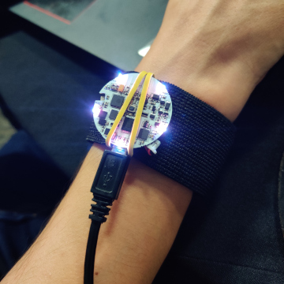
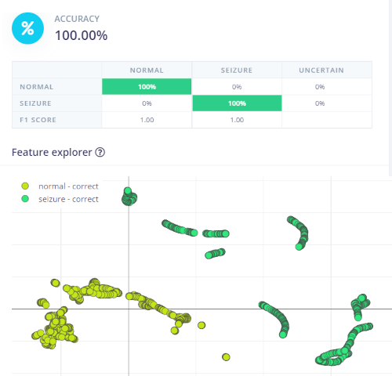
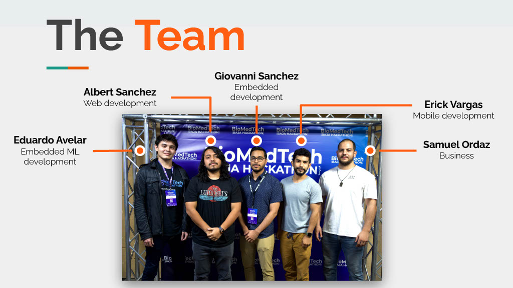

# epimldev-inference
Firmware for epileptic seizure detection using ML

## Introduction

This project was created during the [BioMedTech Baja Hackathon 2022](https://biomed-tech-hackathon.devpost.com/) related to Medical Devices. 

Our Team (MedCreators) proposed a device capable of detecting epileptic seizures, sending an alert and calling to emergency contacts.
One of the main highlights of this project is the use of on-device machine learning to do the inference on the device without the need of sending raw data to external devices to process the IMU data.



More info about the project
* YouTube [video](https://youtu.be/OkyUDAk4aGg)
* Edge Impulse [project](https://studio.edgeimpulse.com/public/136514/latest)
* Devpost [project](https://devpost.com/software/epileptic-seizure-detector-using-on-device-machine-learning)

Info about the hackaton:
* Organizer [iTj](https://itjuana.com/)
* Social media: [Instagram](https://www.instagram.com/biomedtechackathon/)

## About the Project

We collected data using a board with an ESP32 microcontroller. This is supported by the Edge Impulse Platform and a [firmware](https://github.com/eavelardev/qbtn-edge-impulse) was adapted for that task.

Two data classes were defined, a `normal` human behavior (idle, walking, running, dancing ..) and when the `seizure` occurs. 10 minutes were collected for each class, simulating seizures to test the concept. Extra samples were collected for the test set, having a 90/10 distribution.

## Model Testing

We can see how the model can differentiate between the two classes using the test data



## Build

```
idf.py build
```

## Device behavior

* The inference process uses 2 seconds of IMU data. The frequency of the inference can be defined depending on the user's needs. We played with values between 50 to 200 ms.

* A method to activate the seizure flag was created considering a continuous number of inferences with a seizure as an output, to avoid false positive peaks.

* When the seizure flag is active, a window of 4 seconds is opened to be able to deactivate the alert by the user pushing a button in case of a false positive. During this time the device is vibrating intermittently to alert the user.

* If the button is not pressed, the flag to send the alert is activated and is sended via wifi in our demo. This alert is used by a service to make a call to an emergency contact.

## Comments

This project was done in a weekend, is just a proof of concept, but can be used as a base for other related projects.

## Extras


